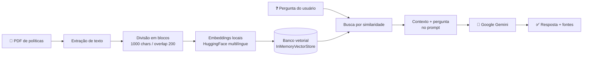

# 🤖 Assistente RAG — Políticas Internas de RH


Assistente conversacional que responde perguntas sobre as **políticas internas de RH** de uma empresa. Usa **RAG (Retrieval-Augmented Generation)**: as respostas são geradas por um LLM, mas **apenas com base no conteúdo de um PDF** — evitando "invenções" fora do documento e sempre citando os trechos que embasaram a resposta.

### 🔗 Demo ao vivo

**👉 [Acesse a demo](https://SEU-APP.streamlit.app)** _(substitua pela URL do seu app no Streamlit Cloud)_

<!-- Salve um print do app respondendo em docs/screenshot.png para ele aparecer aqui -->


---

## ✨ Funcionalidades

- 💬 **Chat** sobre as políticas de RH, com respostas em português.
- 📎 **Upload de qualquer PDF** — envie seu próprio documento ou use o de exemplo.
- 📄 **Citação das fontes** — cada resposta mostra os trechos e páginas usados.
- 🧠 **Anti-alucinação** — o modelo responde "não sei" quando a informação não está no documento.
- ♻️ **Alta disponibilidade** — cadeia de modelos com _retry_ e _fallback_ automático.

## 🛠️ Como funciona



1. **Carrega** o PDF (enviado pelo usuário ou o de exemplo) e extrai o texto de cada página.
2. **Divide** o texto em blocos de 1000 caracteres com sobreposição de 200.
3. **Gera embeddings** locais de cada bloco com um modelo HuggingFace multilíngue (grátis).
4. **Indexa** os embeddings em um banco vetorial em memória.
5. Na pergunta, **busca** os blocos mais relevantes e os envia como contexto para o **Google Gemini**, que redige a resposta — exibindo os trechos-fonte.

## 🧰 Tecnologias

| Camada | Ferramenta |
|--------|-----------|
| Interface | [Streamlit](https://streamlit.io/) |
| Orquestração | [LangChain](https://www.langchain.com/) (LCEL) |
| Banco vetorial | `InMemoryVectorStore` (langchain-core) |
| Embeddings | HuggingFace (`sentence-transformers/paraphrase-multilingual-MiniLM-L12-v2`) — locais e gratuitos |
| LLM | Google Gemini (`langchain-google-genai`) |

## 🚀 Como executar localmente

```bash
# 1. Clone o repositório
git clone https://github.com/LeonardoVitoriodaSilva/Agente_rh.git
cd Agente_rh

# 2. (Recomendado) Crie um ambiente virtual
python -m venv .venv
source .venv/bin/activate   # no Windows: .venv\Scripts\activate

# 3. Instale as dependências
pip install -r requirements.txt
```

Crie um arquivo `.env` na raiz com sua chave da API ([Google AI Studio](https://aistudio.google.com/app/apikey)):

```env
GOOGLE_API_KEY=sua_chave_aqui
```

Rode o app:

```bash
streamlit run app_basic.py
```

O aplicativo abre em `http://localhost:8501`.

## ☁️ Deploy no Streamlit Community Cloud

1. Faça o push do repositório para o GitHub.
2. Em [share.streamlit.io](https://share.streamlit.io), aponte para o repo, branch `main` e arquivo `app_basic.py`.
3. Em **Settings → Secrets**, adicione a chave (formato TOML):
   ```toml
   GOOGLE_API_KEY = "sua_chave_aqui"
   ```

> A chave é lida de `st.secrets` no Cloud e do `.env` localmente — sem expor segredos no código.

## 📁 Estrutura do projeto

```
Agente_rh/
├── app_basic.py        # Aplicação principal (RAG + interface Streamlit)
├── politica_rh.pdf     # Documento de exemplo (políticas de RH)
├── requirements.txt    # Dependências do projeto
└── README.md
```

## 📝 Observações

- Os embeddings são gerados **localmente** e de graça; apenas o LLM (Gemini) consome cota de API.
- O tier gratuito do Gemini tem limite diário de requisições; ao esgotar, o app exibe um aviso amigável e usa modelos de _fallback_.
- Para usar outro documento, basta enviá-lo pelo próprio app (upload) ou substituir o `politica_rh.pdf`.
- O índice vetorial é reconstruído a cada troca de PDF (com cache para não reprocessar o mesmo documento).
